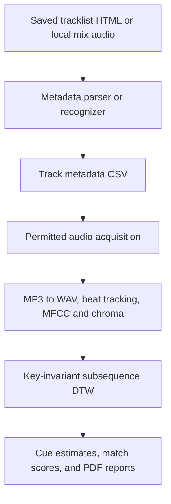
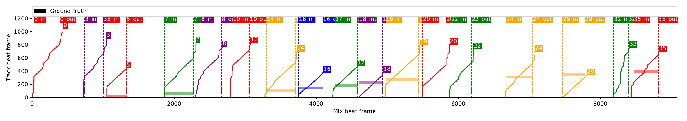
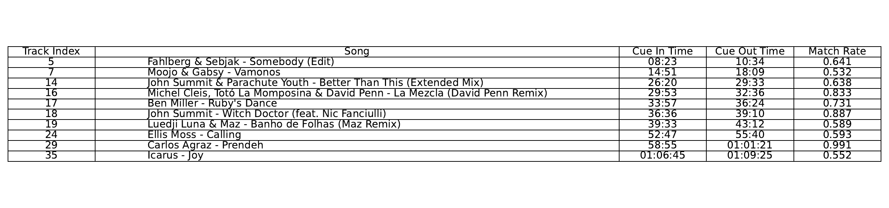

# DJ Mix Analysis Pipeline

An end-to-end music-information-retrieval prototype that maps individual tracks onto a continuous DJ mix, estimates their cue-in and cue-out times, and turns the result into reviewable reports.

> **Outcome:** Parallel track alignment reduced an evaluation run from hours to minutes while producing cue estimates and match scores for human review.

## What it does

- Builds track metadata from a saved HTML tracklist or sampled local mix audio.
- Uses Shazam-based recognition and permission-aware audio acquisition to assemble candidate tracks.
- Aligns beat-synchronous MFCC and chroma features with key-invariant Dynamic Time Warping (DTW).
- Runs track alignment in parallel and exports cue estimates, match rates, and PDF reports.

## Architecture



## Example output

Each coloured path is a track’s best subsequence alignment. Dashed markers show inferred cue boundaries; black markers show available reference timestamps.



<details>
<summary>View the high-confidence match summary</summary>

The companion table filters useful matches and reports their estimated cue times and match rates.



</details>

<details>
<summary>How the matching works</summary>

The pipeline compares beat-synchronous MFCC features, which describe timbre, and chroma features, which describe harmonic content, against the full mix. DTW selects the lowest-cost track-to-mix subsequence; key-invariant mode evaluates all 12 chroma pitch shifts. Sustained diagonal portions of the resulting path are converted from beat indices into cue times.

</details>

## Quick start

Use Python 3.10+ and install FFmpeg first. On macOS:

```bash
brew install ffmpeg
git clone <repository-url>
cd <repository-directory>
python -m venv .venv
source .venv/bin/activate
python -m pip install --upgrade pip
python -m pip install -r requirements.txt
```

**Full pipeline — saved tracklist**

```bash
python src/main.py --html /path/to/tracklist.html
```

**Local-audio analysis — skip download**

```bash
python src/main.py --mp3 /path/to/mix.mp3 --skip-download
```

**Prepared data — align only**

```bash
python src/main.py --mix-id <mix-id> --skip-download --skip-visualize --features mfcc --no-key-invariant
```

Run `python src/main.py --help` for all pipeline switches and output-directory overrides.

## Data and responsible use

This repository distributes code only. It excludes raw audio, saved tracklist pages, generated data, and credentials. Process or download only material you are authorized to use.
